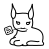

<h1 align="center">
  <br>
  Feedlynx
</h1>

<div align="center">
  <strong>Feedlynx helps you collect links to read or watch later. It generates
    an RSS feed of the links you collect and runs on BSD, Linux, macOS, Windows,
    and more.</strong>
</div>

<br>

<div align="center">
  <a href="https://cirrus-ci.com/github/wezm/feedlynx">
    </a>
  <a href="https://crates.io/crates/feedlynx">
    </a>
  
</div>

<br>

Feedlynx manages an Atom feed on disk. Each time a request to add a link is
received the page at the URL is fetched to determine a title and description.
This information is then used to add a new entry to the feed. If the link is
from YouTube then an embed for the video is generated.

Install
-------

### Pre-compiled Binary

Pre-compiled binaries are available for a number of platforms:

* FreeBSD 13+ amd64
* Linux x86\_64
* Linux aarch64
* MacOS Universal
* Windows x86\_64

Check the [latest release] for download links.

<!--

### Package Manager

Feedlynx is packaged in these package managers:

* Arch Linux: `feedlynx`
* Brew: `feedlynx`
* Chimera Linux: `feedlynx`

-->

### From Source

See [Build From Source](#build-from-source) below.

Integrations
------------

### Browser Extensions

See <https://github.com/wezm/feedlynx-ext> for browser extensions.

### Apple Shortcuts (iOS, iPadOS, macOS)

This Shortcut allows you add links to Feedlynx using the system share sheet.

<https://www.icloud.com/shortcuts/2bc22a709551404a93d55aaf6b0615b4>

Usage
-----

```
USAGE:
    feedlynx [OPTIONS] FEED_PATH

OPTIONS:
    -h, --help
            Prints this help information

    -V, --version
            Prints version information

ENVIRONMENT:

    Required:

        FEEDLYNX_PRIVATE_TOKEN
            Used to authenticate requests to add a new link.

        FEEDLYNX_FEED_TOKEN
            Used in the path to the generated feed.

    Optional:

        FEEDLYNX_ADDRESS
            The address to serve on, default `127.0.0.1`.

        FEEDLYNX_PORT
            The port to serve on, default `8001`.

        FEEDLYNX_LOG
            Controls the log level and filtering.
```

Example:

    feedlynx path/to/feed.xml

Feedlynx requires two environment variables to be set:

* `FEEDLYNX_PRIVATE_TOKEN` used to authenticate requests to add a new link.
* `FEEDLYNX_FEED_TOKEN` used in the path to the generated feed.

Both of these tokens must be at least 32 characters long and hard to guess.
Suitable values can be generated with `feedlynx gen-token`, which will print
a randomly generated token.

The following environment variables may optionally be set:

* `FEEDLYNX_ADDRESS` —- the address to serve on, default `127.0.0.1`.
* `FEEDLYNX_PORT` —- the port to serve on, default `8001`.
* `FEEDLYNX_LOG` — controls the log level and filtering.

Run `feedlynx` with the path to the feed file to start the server. If the file
does not exist it will be created. When the server starts the path on the
server for the feed is printed. This is what you would use to subscribe to the
feed in your feed reader.

**Note:** The feed is capped to 50 items, with older items dropped when a new
item is added. The limit was added to stop the feed growing forever since there
is no way for Feedlynx to know when an item has been read. RSS readers need to
download and process the whole feed whenever there are new items, so imposing a
cap helps limit the size and scope of that work.

### Example

    FEEDLYNX_PRIVATE_TOKEN=ExampleExampleExampleExample1234 \
    FEEDLYNX_FEED_TOKEN=FeedFeedFeedFeedFeedFeedFeedFeed \
    feedlynx feed.xml
    [2024-06-24T08:52:11Z INFO  feedlynx] HTTP server running on: http://127.0.0.1:8001
    [2024-06-24T08:52:11Z INFO  feedlynx::server] feed available at /feed/FeedFeedFeedFeedFeedFeedFeedFeed

If this instance of Feedlynx was hosted at `example.com` the URL of the feed
would be `https://example.com/feed/FeedFeedFeedFeedFeedFeedFeedFeed`.

In a Windows PowerShell terminal the above example would look something like this:

    powershell -Command { $env:FEEDLYNX_PRIVATE_TOKEN="ExampleExampleExampleExample1234"; $env:FEEDLYNX_FEED_TOKEN="FeedFeedFeedFeedFeedFeedFeedFeed"; feedlynx.exe feed.xml }

### Logging

Logging is controlled with the `FEEDLYNX_LOG` environment variable.
The log levels from least verbose to most verbose are:

* `off` (no logs)
* `error`
* `warn`
* `info`
* `debug`
* `trace`

The default log level is `info`. To change the log level to `debug` use
`FEEDLYNX_LOG=debug`. The `FEEDLYNX_LOG` variable also supports filtering. For
example to only show `trace` messages from `feedlynx` (and not some of the
libraries it uses) you would specify: `FEEDLYNX_LOG=trace=feedlynx`. For more
details refer to the [env_logger documentation][env_logger].

At the `debug` level Feedlynx will print a web-server styled line for each
request received.

    [2024-06-24T07:48:39Z DEBUG feedlynx::server] 127.0.0.1:50202 "GET /feed/FeedFeedFeedFeedFeedFeedFeedFeed" 200 "curl/8.8.0"

This includes the remote address, request method and path, response status
code, and client user agent.

### API

The server exposes three end-points:

* `GET /` — shows a brief page about the Feedlynx server.
* `POST /add` —  add a new link. Requires a body in `application/x-www-form-urlencoded` (web form) format.
  - Fields:
    - `url` (required) — the link to add.
    - `token` (required) — the value of `FEEDLYNX_PRIVATE_TOKEN`.
    - `title` (optional) — the title of the link.
* `POST /info` — retrieve informatin about the server. Requires a body in `application/x-www-form-urlencoded` (web form) format.
  - Fields:
    - `token` (required) — the value of `FEEDLYNX_PRIVATE_TOKEN`.
  - Response:
    - JSON object. Keys:
      - `status`: `"ok"` or `"error"`.
      - `version`: present when status is `"ok"`. Contains server version.
      - `message`: present when status is `"error"`. Contain an error message.
* `GET /feed/<FEEDLYNX_FEED_TOKEN>` — the generated feed. Use this to subscribe to the feed in your feed reader.

#### cURL Example

The following cURL command will add `https://github.com/wezm/feedlynx` to the
Feedlynx feed:

    curl -d 'url=https://github.com/wezm/feedlynx' \
         -d 'token=ExampleExampleExampleExample1234' \
         http://localhost:8001/add

Deployment
----------

It's recommended that Feedlynx be deployed behind a reverse proxy such as nginx
that can provide HTTPS termination.

Build from Source
-----------------

**Minimum Supported Rust Version:** 1.79.0

Feedlynx is implemented in Rust. See the Rust website for [instructions on
installing the toolchain][rustup].

### From Git Checkout or Release Tarball

Build the binary with:

    cargo build --release --locked

The binary will be in `target/release/feedlynx`.

### From crates.io

    cargo install feedlynx

### Compile-time Options (Cargo Features)

Feedlynx supports the following compile-time options:

* `rust-tls` (default): use the `rust-tls` crate for handling TLS connections.
* `native-tls`: use the `native-tls` crate for handling TLS connections. This
  might be a better option when building on Windows.

To build with `native-tls` invoke Cargo as follows:

    cargo build --release --locked --no-default-features --features native-tls

If packaging Feedlynx for an operating system registry it might make sense to
use `native-tls`. On Linux and BSD systems that adds a dependency on OpenSSL.

### Using a Container (Docker or Podman)

A Dockerfile is included in the repository. A lightweight container image can
be built like this:

    docker build -t feedlynx .

The container expects the path to the feed in `/data`, so we can use a volume
mount to have persistent storage:

    docker run -p 127.0.0.1:8001:8001 -v ./data:/data \
      -e FEEDLYNX_PRIVATE_TOKEN=ExampleExampleExampleExample1234 \
      -e FEEDLYNX_FEED_TOKEN=FeedFeedFeedFeedFeedFeedFeedFeed /data/feed.xml

The application then can be accessed at <http://localhost:8001> like it would
run without a container. If using Podman, just replace the usage of the
`docker` command with `podman`.

Credits
-------

Feedlynx incorporates code from the following projects under the terms of the
Apache 2.0 licence:

- base62 generation code from [nano-id].
- Random number generation from [rustc] via [matklad] and [orhun]
- UNIX signal handling from [habitat].
- Windows signal handling from [ctrlc].

The adorable Feedlynx logo was drawn by [@DiDoesDigital](https://didoesdigital.com).

Licence
-------

This project is dual licenced under either of:

- Apache License, Version 2.0 ([LICENSE-APACHE](https://github.com/wezm/feedlynx/blob/master/LICENSE-APACHE))
- MIT license ([LICENSE-MIT](https://github.com/wezm/feedlynx/blob/master/LICENSE-MIT))

at your option.

[ctrlc]: https://github.com/Detegr/rust-ctrlc/blob/b543abe6c25bd54754bbbbcfcff566e046f8e609/src/platform/windows/mod.rs
[env_logger]: https://docs.rs/env_logger/0.11.3/env_logger/index.html
[habitat]: https://github.com/habitat-sh/habitat/blob/631af77f7705fb4ea68a5464f269e0c0b9283a91/components/core/src/os/signals/unix.rs
[latest release]: https://github.com/wezm/feedlynx/releases/latest
[matklad]: https://github.com/matklad/config/blob/b8ea0aad0f86d4575651a390a3c7aefb63229774/templates/snippets/src/lib.rs#L28L42
[nano-id]: https://github.com/viz-rs/nano-id/blob/a9022772b2f1ce38929b5b81eccc670ac9d3ab23/src/lib.rs
[orhun]: https://blog.orhun.dev/zero-deps-random-in-rust/
[rustc]: https://github.com/matklad/config/blob/b8ea0aad0f86d4575651a390a3c7aefb63229774/templates/snippets/src/lib.rs#L28L42
[rustup]: https://www.rust-lang.org/tools/install
